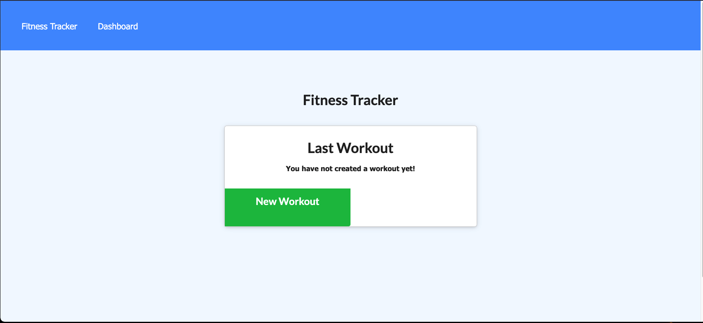
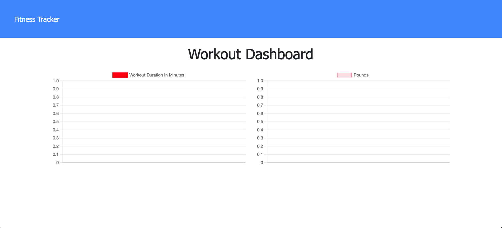

# Workout-Tracker#

# Description

Fitness Tracker application to track the distance, duration, and exercises of a workout, using MongoDB, express routing, and Mongoose.

# Table of Contents

* [Installation](#installation)
* [Usage](#usage)
* [Technology](#technology)
* [Features](#features)
* [Contribution](#contribution)
* [Questions](#questions)

# Deployed Website: 
[Workout Tracker](https://arcane-oasis-18047.herokuapp.com/)

# Screenshot :

||


# User Story

```
As a user, I want to be able to view create and track daily workouts. 

I want to be able to log multiple exercises in a workout on a given day.

I should also be able to track the name, type, weight, sets, reps, and duration of exercise. 

If the exercise is a cardio exercise, I should be able to track my distance traveled.
```
# Installation

1. Clone this repository to your local machine.

2. Run `npm install` to install dependencies required for this project.

3. Run `node server.js` to start the application.


# Usage

* Create a new workout or add to an existing workout.

* Choose workout type from resistance or cardio.

* Fill out exercise details and add it to ongoing workout or mark it complete.

* View your progress over time on the dashboard and current stats on the homepage.

# Technology

**1. [MongoDB]

**2. [Mongoose]

**3. [Express.js]

**4. [Node.js]
# Features

1. NoSQL Database MongoDB is used to create database for this application.

2. Express server is used to handle routing.

3. Mongoose is used to create model schema.

4. User can track workout progress by different charts on dashboard.

5. Application is deployed to Heroku and MongoDB database is connected via MongoDB Atlas.

# Contribution

Please let me know how I can improve this project. Issues and pull requests are always welcome.

# Questions 

If you have any questions about the repo, 
contact me directly at [Email](mailto:josejrrosas@yahoo.com).